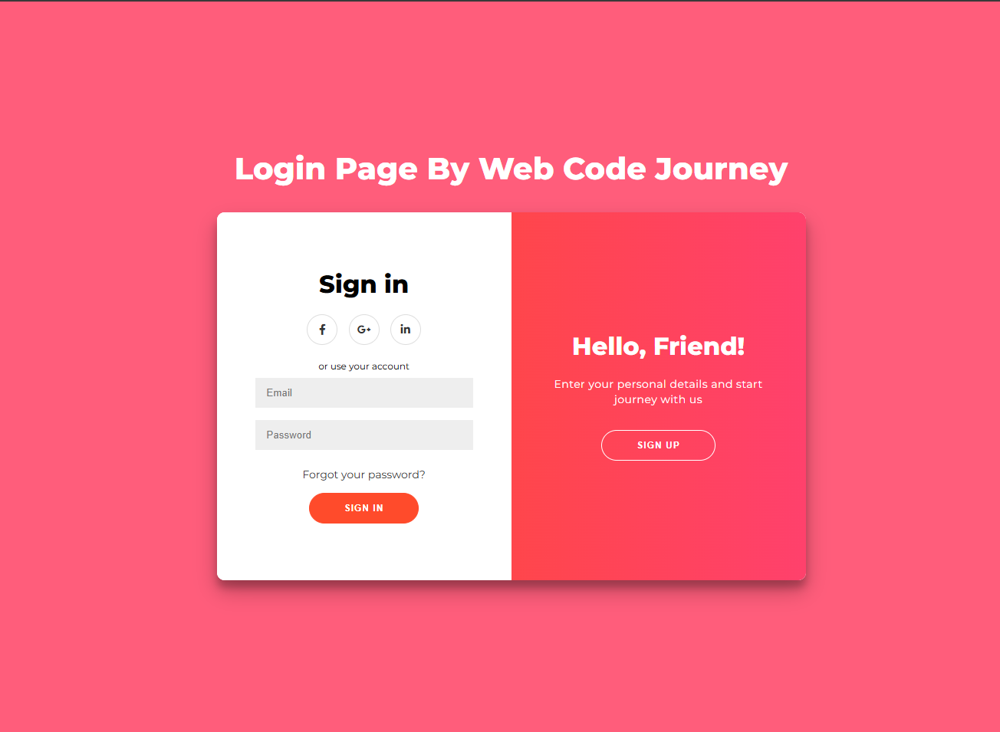

# Login Page  

A modern and responsive **Login & Signup Page** built using **HTML, CSS, and JavaScript** with smooth animations and social media login buttons.  

## Features  

- Stylish & responsive UI  
- Smooth toggle animation between **Sign In** and **Sign Up**  
- Fully responsive design  
- Social media login buttons (Facebook, Google, LinkedIn)  
- Gradient background with clean layout  

## Screenshot  



## Technologies Used  

- HTML5  
- CSS3 (Flexbox & Animations)  
- JavaScript (Vanilla JS)  
- Font Awesome (for icons)  
- Google Fonts - Montserrat  

## Project Structure  

```
├── index.html     # Main HTML file
├── style.css      # Stylesheet
├── script.js      # JavaScript for toggle animation
└── README.md      # Project documentation
```
## Live Demo  
 
## [Click here to view](https://himanshugupta278.github.io/Login-page/)